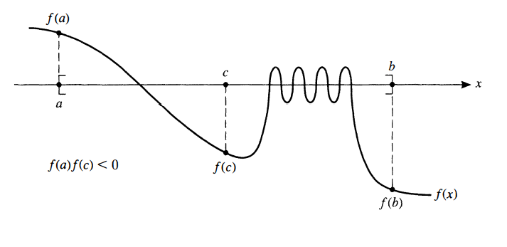
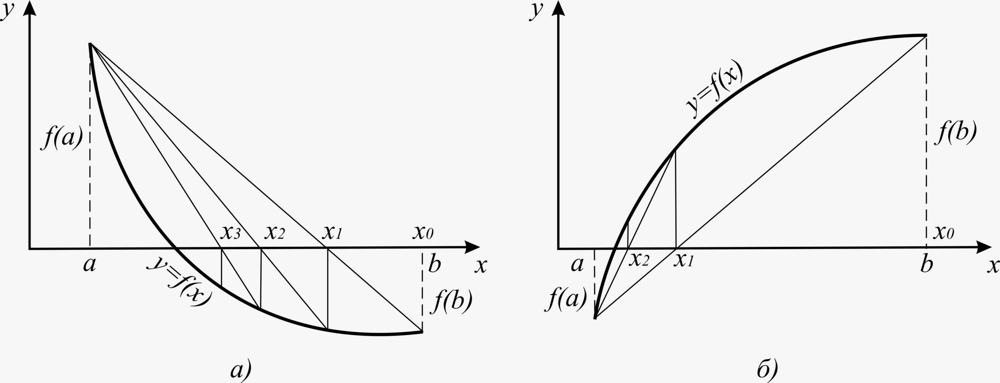
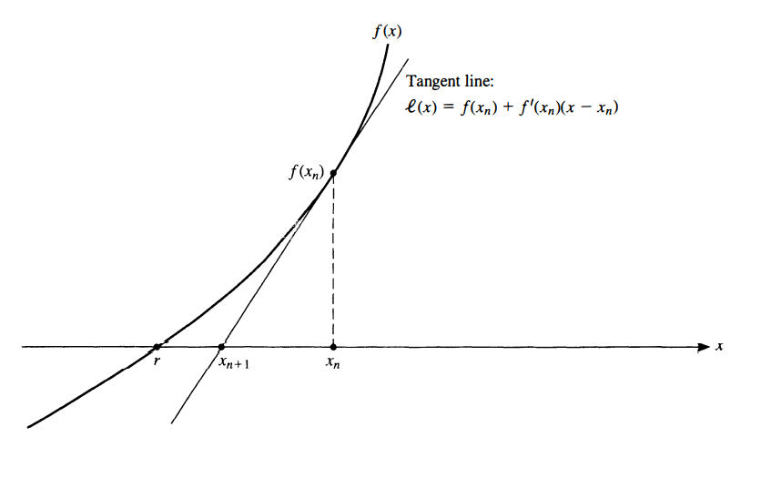

# Giải gần đúng phương trình phi tuyến

### Tiên quyết: hệ quả định lý giá trị trung gian

$f$ liên tục trên $[a,\, b]$, $\quad f(a).f(b) < 0$

$\implies \exists$ ít nhất 1 nghiệm $x^{*}$  của phương trình $f(x) = 0$ trong $(a, b)$

### Phương pháp chia đôi

Chia đôi khoảng $[a,\, b]$ cho đến khi tìm được nghiệm xấp xỉ đủ tốt

Tính $c = \frac{a + b}{2}$

Nếu $c$ không phải là nghiệm $\implies (a,\,c)$ hoặc $(c,\,b)$ có nghiệm

Nếu $f(c).f(a) < 0 \implies$ có nghiệm trong $(a,\,c)$ (vì định lý giá trị trung gian; làm tương tự nếu $f(c).f(b) < 0$)

$\implies$ Tiếp tục chia đôi cho đến khi nghiệm thu được $< \epsilon$ ($\epsilon$ là sai số chấp nhận được)

### Phương pháp dây cung

##### Điểm Fourier

$f$ khả vi cấp 2, $f', f''$ không đổi dấu trên $(a,\, b)$

Nếu $f(x).f''(x) > 0$ thì $x$ được gọi là điểm Fourier của $f$

##### Thuật toán

Giả sử $f$ liên tục trên $(a,\,b)$, $f(a).f(b) < 0$, $b$ là điểm Fourier (tương tự nếu $a$ là điểm Fourier)

Khi đó chọn $x_0 = a$, tiến hành:

$$
x_{n+1} = x_n - \frac{f(x_n)}{f(x_n)-f(b)} \cdot (x_n - b)
$$

##### Định lý

$f', f''$ không đổi dấu thì $\{x_n\}$ hội tụ đơn điệu đến nghiệm

##### Sai số

Gọi $m = \min_{[a,\,b]} |f'(x)|$ ; $M = \max_{[a,\,b]} |f'(x)|$

Khi đó:

$$
|x_{n+1} - x^{*}| \leq \frac{M-m}{M} \cdot |x_{x+1}-x_n|
$$

***

### Phương pháp lặp đơn

Ý tưởng: định nghĩa hàm $\varphi(x)$ sao cho $f(x) = 0 \iff x = \varphi(x)$

Tính $x_n = \varphi(x_{n-1})$ cho đến khi $f(x_n) < \epsilon$

##### Điểm bất động

$x_0$ là điểm bất động của hàm số $\varphi(x)$ nếu $\varphi(x_0) = x_0$

**Định lý:** Nếu $\varphi(x)$ là tự ánh trên $[a,\, b]$ thì có ít nhất 1 điểm bất động $x^{*} \in [a,\,b]$

##### Ánh xạ co

$f$ là ánh xạ co trên $[a,\,b]$ nếu $\exists L: \quad |f(x) - f(y)| \leq L|x-y|$

Nếu $f$ khả vi trên $[a,\,b]$ và $\max_{[a,\,b]} |f'(x)| = L < 1$ thì $f$ là ánh xạ co với hệ số co $L$ trên $[a,\,b]$

**Định lý**

Giả sử $\varphi(x)$ tự ánh trên $[a,\,b]$, $\varphi(x)$ là ánh xạ co trên $[a,\,b]$

Khi đó: dãy lặp $x_{n+1} = \varphi(x_n)$ hội tụ đến điểm bất động duy nhất của $\varphi, \forall x_0 \in [a,\,b]$

**Sai số**

Ước lượng tiên nghiệm (dùng được trước khi tính):

$$
|x_n - x^{*}| \leq \frac{L^n}{1-L} \cdot |x_1 - x_0|
$$
Ước lượng hậu nghiệm (chính xác hơn so với tiên nghiệm)

$$
|x_n - x^{*}| \leq \frac{L}{1-L} \cdot |x_n - x_{n-1}|
$$

##### Phương pháp Newton

**Ý tưởng:** tại $(x_n,\, f(x_n))$ kẻ đường tiếp tuyến cắt trục hoành, lấy giao điểm làm $x_{n+1}$

**Công thức:**

$$
x_{n+1} = x_n - \frac{f(x_n)}{f'(x_n)}
$$

**Định lý**

Giả sử:
1. $f(a).f(b) < 0$
2. $f', f''$ không đổi dấu trên $[a,\,b]$
3. $x_0$ là 1 điểm Fourier

Khi đó phép lặp Newton hội tụ đơn điệu đến nghiệm

**Sai số**

Gọi $m = \min_{[a,\,b]} |f'(x)|$ ; $M = \max_{[a,\,b]} |f''(x)|$

Khi đó:

$$
|x_n - x^{*}| \leq \frac{M}{2m} \cdot |x_n - x_{n-1}|^2
$$

##### Phương pháp Newton cải biên

**Ý tưởng:** Tương tự như phương pháp Newton nhưng chỉ sử dụng tiếp tuyến đầu tiên để tìm $x_{n+1}$, $\implies$ không phải tính đạo hàm nhiều lần

**Công thức:**

$$
x_{n+1} = x_n - \frac{f(x_n)}{f'(x_0)}
$$

Đạo hàm chỉ phải tính 1 lần, nhưng hội tụ chậm hơn.

##### Phương pháp cát tuyến

**Ý tưởng:** Tương tự như phương pháp Newton, nhưng dùng đường thẳng đi qua $x_n$ và $x_{n-1}$ để thay cho tiếp tuyến

**Công thức:**

$$
x_{n+1} = x_n - \frac{f(x_n)}{\frac{f(x_n) - f(x_{n-1})}{x_n-x_{n-1}}}
$$

Khi $x_n \approx x_{n-1}$ thì:

$$
\frac{f(x_n) - f(x_{n-1})}{x_n-x_{n-1}} \approx f'(x_n)
$$
