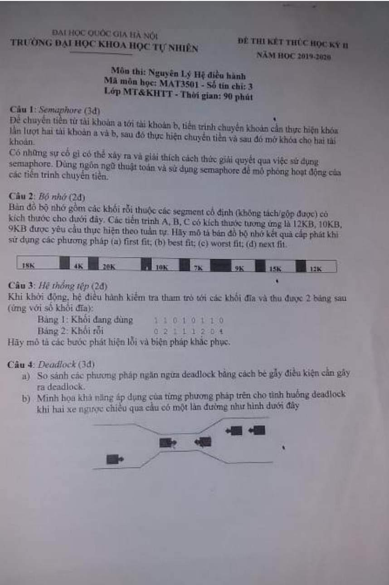

### Câu 4:
##### Note: Bản nháp


```c
#define EAST 0
#define WEST 1

semaphore available[2] = {0, 3}, mutex = 1;
int dir;
```

```c
car(int dir) {
	down(&available[dir]);
	down(&mutex);
	print("Xe bắt đầu qua cầu");
	up(&mutex);
	enter_bridge(int i);
	sleep(3);
	down(&mutex)
	exit_bridge(int i);
	up(&available)
	if(available = 3) {
		dir = (dir + 1) % 2;
		up(&available[dir]);
		up(&available[dir]);
		up(&available[dir]);
	} else {
		up(&available[dir]);
	}
	print("Xe đã ra khỏi cầu");
	up(&mutex);
}

```