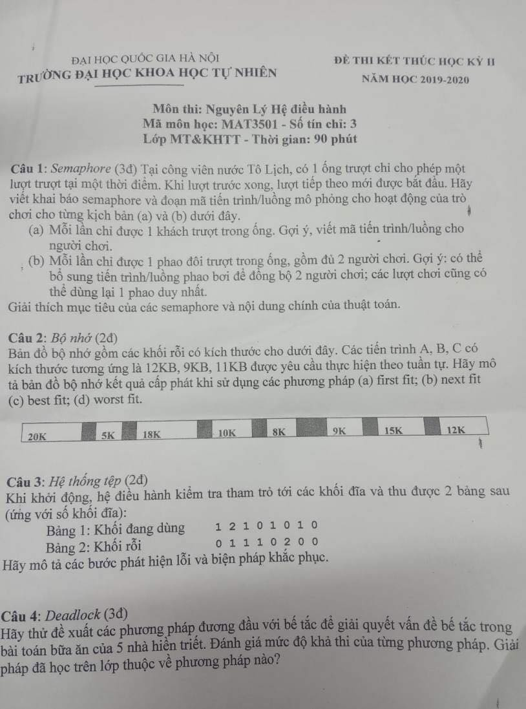

### Câu 1:

**a.** 

Khai báo semaphore:

```c
semaphore mutex = 1;
```

Mã tiến trình:

```c
person(int i) { //người chơi
	down(&mutex);
	slide(i); // cho người i trượt trong ống
	up(&mutex);
}
```

**b.**

Khai báo semaphore:

```c
semaphore mutex = 1;
semaphore available = 2; //số chỗ trống trong phao
semaphore waiting = 0; //số người đang ngồi trong phao
int[] in_floaty; //những người đang ngồi trong phao
```

Mã tiến trình:

```c
floaty() { //phao bơi, dùng 1 phao duy nhất
	while (TRUE) {
		down(&waiting); //nếu chưa đủ 2 người vào phao, ngủ chờ
		down(&waiting);
		down(&mutex); //in_floaty là tài nguyên dùng chung => cạnh tranh
		slide(in_floaty[0], in_floaty[1]); //cho phao trượt
		in_floaty = NULL; //người trong phao bằng rỗng
		up(&available); //mở lại chỗ, đánh thức những người chơi đang ngủ chờ
		up(&available);
		up(&mutex);
	}
}

person(int i) { //người chơi
	down(&available); //nếu phao hết chỗ thì ngủ chờ
	down(&mutex); //in_floaty là tài nguyên cạnh tranh
	enter_floaty(i); //đi vào phao
	up(&waiting); //nếu đủ 2 người, đánh thức phao đang ngủ chờ
	up(&mutex);
}

enter_floaty(int i) { //hàm đưa người chơi vào phao bơi
	if (in_floaty[0] == NULL) { //nếu phao chưa có người
		in_floaty[0] = i; //thì vào vị trí 0
	} else {
		in_floaty[1] = i; //có người rồi thì vào vị trí 1
	}
}
```

### Câu 3:
- Khối đĩa số 2 có `A[0, 1] + A[1, 1] > 1` => Lỗi vừa bận vừa rỗi => Xóa khỏi danh sách móc nối các khối rỗi
- Khối đĩa số 2 có `A[0, 1] > 1` => Lỗi bận nhiều lần => Sao lặp nội dung ra khối rỗi mới rồi cho mỗi tệp trỏ tới một khối đĩa riêng
- Khối đĩa số 3 có `A[0, 2] + A[1, 2] > 1` => Lỗi vừa bận vừa rỗi => Xóa khỏi danh sách móc nối các khối rỗi
- Khối đĩa số 6 có `A[1, 5] > 1` => Lỗi rỗi nhiều lần => Xóa bớt trùng lặp trong danh sách các khối rỗi